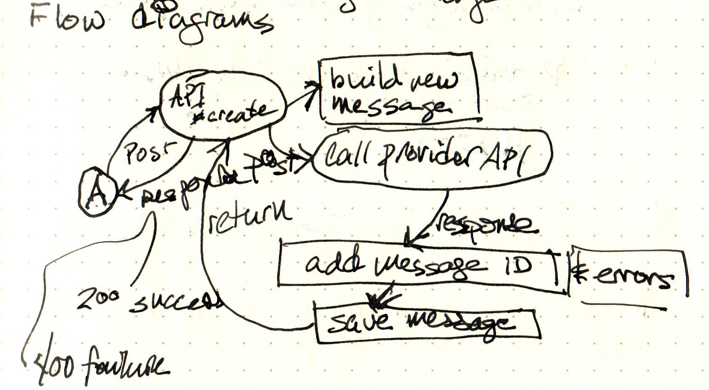
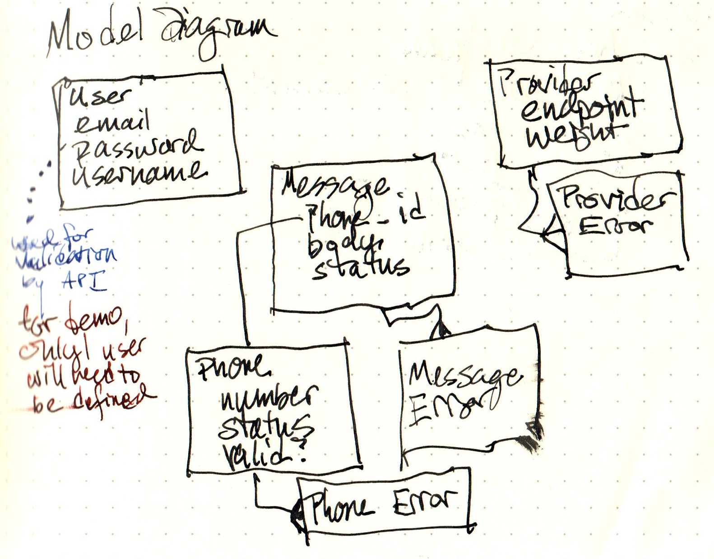
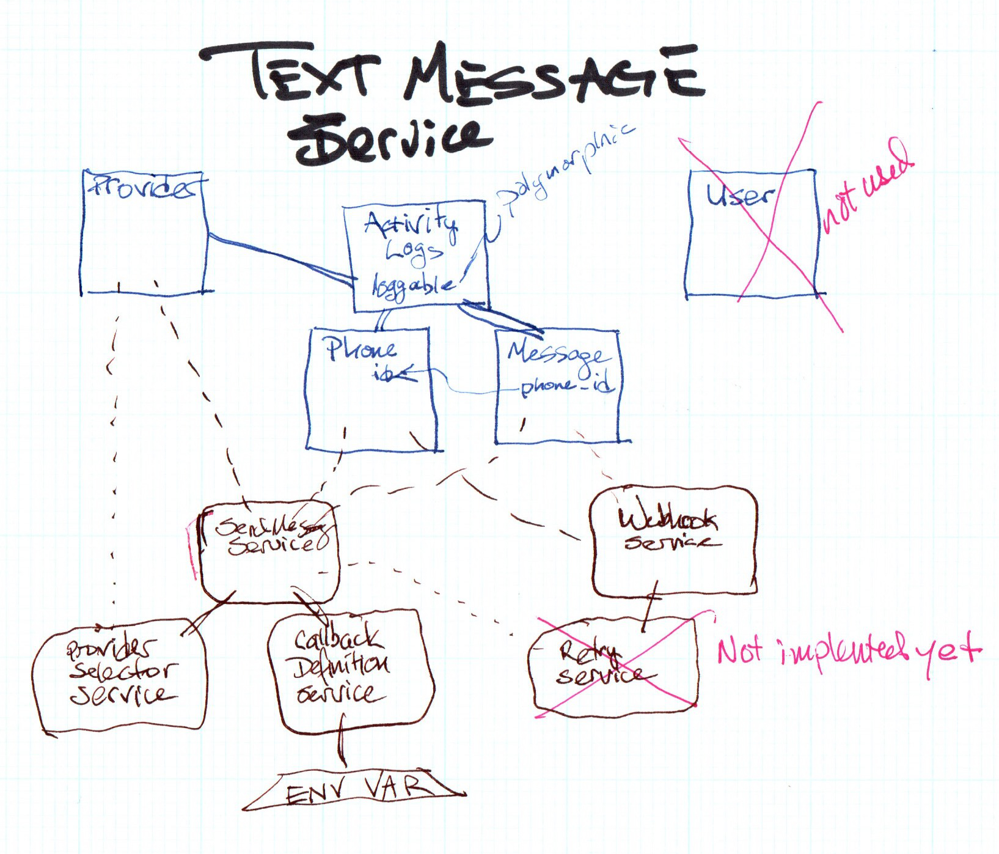

# TextServiceExample

This is a coding example for creating a texting feature in a Rails app. It's only about the feature here, but normally this would be added to an existing app.

## Approach ##

My approach was to develop the rudimentary client that could talk to the provider serices by posting a message, and getting back the response.

Next came the models for storing data and models for acting on the data, aka services.

Next came the controllers for getting the new message and handing it off to the service for sending a message, and the controller for receiving a webhook from the provider to process the result of sending the message, including updating models, adding logs and so on.

Finally cam the controllers and views for listing the providers, messages, and phone numbers. 

The specifications are difined in the problem description, and I won't necessarily repeat any more.

## Dependencies

The typical dependencies for a modern Rails project

- Redis (on a Mac, install with HomeBrew)
- Ruby 3.1.1
- Bundler 2.3.7
- Rails 7.0.4
- ngrok (from [ngrok.io](https://ngrok.io "Opening a tunnel to your local app")) - used to provide a tunnel that can be used for webhook callbacks

Other dependencies are handled by the Gemfile and package.json.

## Getting it running ##

You're going to need 3 terminal windows for all of this:

1. for the Rails server
2. for the ngrok server
3. for doing things from the command line

To get everything in order, run:

``` shell
$ bundle install
$ yarn install 
$ bundle exec rails db:migrate:reset
$ bundle exec rails db:fixtures:load

# bring up the tunneling proxy, ngrok, in another terminal window
$ ngrok http 3000

# back in the original terminal window
$ export RAILS_DEVELOPMENT_HOSTS="<the hostname part of the ngrok URL>"
$ bundle exec rails server

# in a new terminal window
$ open http://localhost:3000
```
    
See "Live testing" below for a couple of ways to send messages to the API.
    
## Databases

For practicality I decided to implement using SQLite instead of Postgresql or MySQL. As it's only going to need to handle a tiny number of messages, it should be fine for demo purposes.

Stand up the database for the first time with:

    $ rails db:migrate
    $ rails db:fixtures:load

The following will tear down the databases and reset everything:

    $ rails db:migrate:reset
    $ rails db:fixtures:load

*(Good when you're futzing with migrations, or mess up the data somehow.)*

## Using `ngrok`

Using `ngrok` is pretty simple with this application.

_BEFORE_ you start the rails server, open a terminal window and run:
``` shell
$ ngrok http 1000 # => starts a proxy pointing at localhost:3000
```

After ngrok is running in the terminal, copy *just* the host part of the ngrok proxy.

In a new terminal window, enter:
``` shell
$ export RAILS_DEVELOPMENT_HOSTS="<paste in the ngrok host>"
$ bin/rails s 
```
## Testing

I chose to use Minitest and ActiveSupport::TestCase to keep testing fast and simple. I'm also following a philosophy for testing in the demo to test only code written for the demo, and not deal with verifying everything else one might do with models, controllers, services, libraries, and the like.

Run tests with:

    $ rails test
    
### Live testing ###

This is for doing some live testing where you don't want the VCR cassettes to get in your way.

From the command line, hit the send API from `curl`:

``` shell
curl -is -X POST \
     -H 'Content-type: application/json' \
     -d '{"phone_number":"8005551212","message_body":"a message from curl"}' \
     'http://localhost:3000/api/v1/send.json'
```

From the Rails console (pry) :

``` ruby
# Create a phone, then a message
p = Phone.create(number: "8005551212", status: "active")
m = Message.create(phone_id: p.id, message_body: "a message from rails console", status: "sending")

# Create a service instance
s = SendMessageService.new(message: m)

# Send the message
s.send!

# Explore the result
s.client.result
```

## Development

In the mode of keeping things simple, testable, and easy to develop, I've forgone some niceties. There's virtually no front end to the app, except to see a list of messages, and as mini-page app to fire off a new text message request in the background to the API.

## Archicture

### Flow Diagram

Just a rough sketch of the flow of information through this app.



1. Agent "A" posts a request to the API endpoint to create a message and send it to the provider
2. The provider replies and the response is used to update the message
3. The provider sends a post request to the web hook endpoint that includes the message ID returned earlier and the status of the message delivery.
4. The message is updated with the information, and if the max number of tries are exceeded, fails the message completely

There are other tracking mechanisms in play as well to monitor and adjust the feature's behaviour based on the responses and web hooks from the provider.

### Models Diagram

Original diagram:



Final diagram:



1. `User` holds just enough information to validate the API request using HTTP Basic auth. For the demo, there's only one user. Did not end up using this or doing any authorization of the app endpoints.
2. `Message` contains the message id and body, as well as the key of the phone number.
4. `Phone` holds the  phone number for a requested measure, as well as status, validity.
6. `Provider` contains the information needed to interact with providers and keep errors, statistics, and status.
7. `ActivityLog` contains more detailed information about each use of `Phone`, `Message`, and `Provider`

### Services Classes

To keep both controllers and persistence models thin, I'm using service classes that perform the logic of the application.

### Libraries

To isolate the interface with the service providers, I'm using a library to generalize the interface for calling the providers, which allows for delete-ability / replacement.

#### provider_api

The library was initialized with `bundle gem provider_api` in the `./lib/` directory. The `.git` directory was removed so it would all be in the same repo. 

The library has it's own [README file](./lib/provider_api/README.md "README for provider_api library")

The ruby gem structure is great for adding internal libraries as it provides a familiar structure and just removes the problem of figuring out how to do that. There are some tricky bits to make it work properly with the whole app.

##### Gemfile

The `Gemfile` needs an entry to the library to treat it as a valid gem when running `bundle install`:

file `'./Gemfile'`:
``` ruby
gem 'provider_api', path: './lib/provider_api/'
```


## Left to do:

1. ~~If you receive errors from the SMS providers, make sure you try it a few times. They intentionally return errors part of the time. Also double check that your request format meets the specification.~~ Happy to say this now works.
2. If a provider is down (returns a 5xx status code), retry through the other provider. The load balancing part of this is implemented, but updating the provider if the service gets a 5xx error is not,
3. ~~If no provider is available, the message is considered failed. Your application may handle this in whatever way is appropriate for your API.~~ This might already work, but it also might produce an error if the active provider list is empty. **ETA:** this works as expected now.
2. Implement widget to send a message from the browser
3. Stand up the app on a real server

## Thoughts about the exercise ##

I appreciated being able to work through a more real-world example clearly related to what Parentsquare's product needs to do. I really enjoyed myself, being able to stretch out and really show how I think this would work in a production environment.

I headed into this with the idea that it would take 3 days, forgetting the time I needed to set up a project and the development environment. Equally, I intended to put this up on a server someplace, but finding free offerings for a Rails app took longer than I'd hoped. I settled for trying to create a suitabkle server on a five buck per month hosting service through Gandi.net, but that's probably a coupoe more days as well.

There are some features that aren't done that were in the spec.

Doing a retry on a failed message should be fairly easy. Included an iteration field in the message to keep track of how many times it's been tried. I would set a constant to determine the max number of retries, and skip the message after that. **ETA:** This has been implemented.

I also am not bouncing between providers when a failure happens. This would take some work to figure this out given my implementation. The message log should include the provider used for the send attempt so a different one can be chosen. It would make the weighted randon choice a bit more difficult. The way I'd approach it is reject it after getting the set of active providers, then doing the weighted random select on the rest of them. **ETA:** I've verified the code to pick the provider will work with one or both providers out of commission, and the consumer wson't validate if the provider in `nil`, but nothing then marks the message status. **ETA:** happy to say this now works, and a retry can happen without the previously used provider. Perhaps it would be better to make it all previous providers, but right now it's just the last one.

I'm not sure what would happen if there are no providers to choose from currently. The code probably doesn't handle a `nil` provider and that's a possibility in any case.

There's nothing in code to mark a provider as "down" or "inactive" upon receipt of a 500 error. This wouldn't be hard to do as the information is passed back up to where it can be used.

The architecture is written as though it can run in the time of a application server (e.g. puma). Given the toy nature of things, it likely will. However, many of the operations would be better done in the background, leaving the controllers free to return quickly to the callers. Since the operations are written as service objects, they can be called from background jobs to complete their tasks. I would likely have to add more robust code for some of the services as I wasn't thinking of them not being able to return info to the caller; matching up messages with the GUID returned from the provider could be tricky. If I were to write a messages API, the original caller would need to keep some info about the original message to get more detailed info, perhaps just returning the `message.id` field (or some sort of obfuscated string)?

Putting the webhook request into a background job should be quite easy, just passing along the `status` and provider's `message_id`. But again, not knowing the outcome of that means always returning `:ok`. I wasn't sure if the webhook request does anything with an `:unprocessable_entity` response (like retrying) but it would be a safe bet that some do.

I wanted to provide a little widget that could be popped up to send the new message AJAX request, but right now, I'd probably have to take a day to refresh myself on doing that in JavaScript, since it's been a minute since I had to build something like that.
